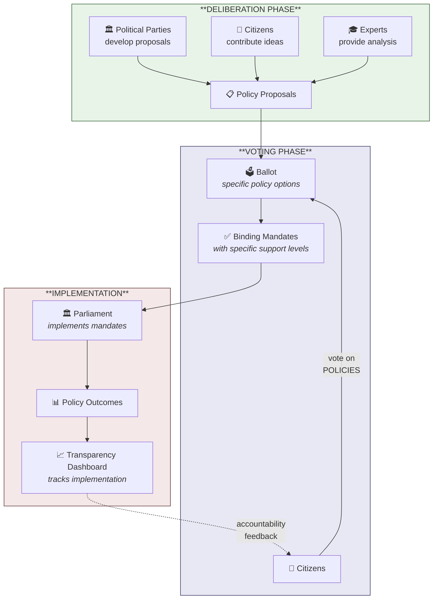
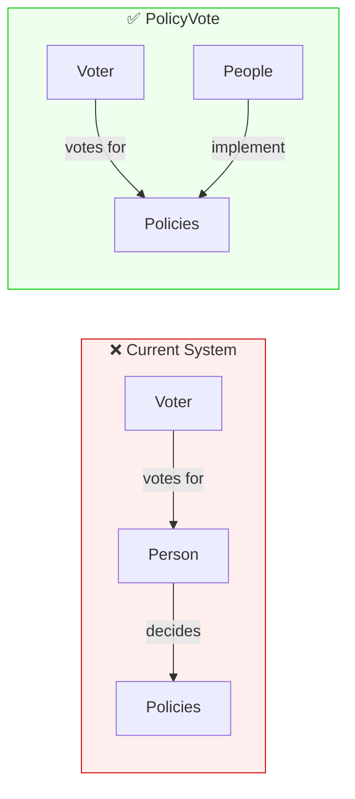
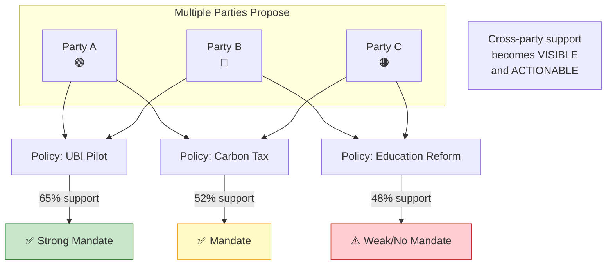

# PolicyVote Overview Diagram

```mermaid
flowchart TB
    subgraph deliberation["**DELIBERATION PHASE**"]
        direction TB
        parties["🏛️ Political Parties<br/>develop proposals"]
        citizens_d["👥 Citizens<br/>contribute ideas"]
        experts["🎓 Experts<br/>provide analysis"]

        parties --> proposals["📋 Policy Proposals"]
        citizens_d --> proposals
        experts --> proposals
    end

    subgraph voting["**VOTING PHASE**"]
        direction TB
        proposals --> ballot["🗳️ Ballot<br/><i>specific policy options</i>"]
        citizens_v["👥 Citizens"] --> |"vote on<br/>POLICIES"|ballot
        ballot --> mandates["✅ Binding Mandates<br/><i>with specific support levels</i>"]
    end

    subgraph implementation["**IMPLEMENTATION**"]
        direction TB
        mandates --> parliament["🏛️ Parliament<br/><i>implements mandates</i>"]
        parliament --> outcomes["📊 Policy Outcomes"]
        outcomes --> dashboard["📈 Transparency Dashboard<br/><i>tracks implementation</i>"]
    end

    dashboard -.->|"accountability<br/>feedback"| citizens_v

    style deliberation fill:#e8f4e8,stroke:#2d5a2d
    style voting fill:#e8e8f4,stroke:#2d2d5a
    style implementation fill:#f4e8e8,stroke:#5a2d2d
```

## Key Insight

```mermaid
flowchart LR
    subgraph current["❌ Current System"]
        c_voter["Voter"] -->|"votes for"| c_person["Person"]
        c_person -->|"decides"| c_policy["Policies"]
    end

    subgraph policyvote["✅ PolicyVote"]
        p_voter["Voter"] -->|"votes for"| p_policy["Policies"]
        p_person["People"] -->|"implement"| p_policy
    end

    style current fill:#ffeeee,stroke:#cc0000
    style policyvote fill:#eeffee,stroke:#00cc00
```

## Multi-Party Dynamics

```mermaid
flowchart TB
    subgraph parties["Multiple Parties Propose"]
        partyA["Party A<br/>🟢"]
        partyB["Party B<br/>🔵"]
        partyC["Party C<br/>🟠"]
    end

    partyA --> policy1["Policy: UBI Pilot"]
    partyB --> policy1
    partyA --> policy2["Policy: Carbon Tax"]
    partyC --> policy2
    partyB --> policy3["Policy: Education Reform"]
    partyC --> policy3

    policy1 --> |"65% support"| mandate1["✅ Strong Mandate"]
    policy2 --> |"52% support"| mandate2["✅ Mandate"]
    policy3 --> |"48% support"| mandate3["⚠️ Weak/No Mandate"]

    note1["Cross-party support<br/>becomes VISIBLE<br/>and ACTIONABLE"]

    style mandate1 fill:#c8e6c9,stroke:#2e7d32
    style mandate2 fill:#fff9c4,stroke:#f9a825
    style mandate3 fill:#ffcdd2,stroke:#c62828
```

---

*These diagrams can be rendered in Obsidian, GitHub, or any Mermaid-compatible viewer.*
