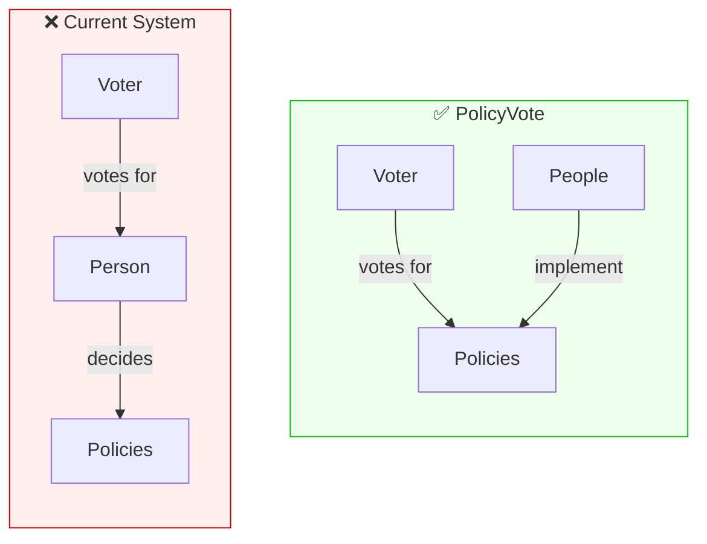

# PolicyVote: Shifting Elections from Personalities to Policies

*A proposal for electoral reform that addresses the root dysfunction of modern democracy*

---

## The Problem We Don't Talk About

Democratic elections are supposed to translate citizen preferences into policy outcomes. In practice, they often fail at this basic function—not because of voter fraud or procedural failures, but because of something more fundamental: **we vote for people, not policies**.

Consider what happens during an election campaign. Candidates compete for visibility. Debates become exercises in personal attacks and defensive posturing. Media coverage focuses on gaffes, charisma, and horse-race polling. The actual policy content—what a government will *do* once elected—takes a back seat to personality and tribal affiliation.

This isn't a bug in the system. It's a direct consequence of how we've structured electoral choice. When the ballot asks "who do you want to represent you?" rather than "what do you want your government to do?", the entire apparatus of democratic competition orients around the former question.

The results are predictable:

**Wrong incentives for candidates.** Success requires skill at self-promotion, media management, and opponent attacks. People with genuine policy expertise but no appetite for the spotlight stay away. Those who thrive on attention and recognition are selected for.

**Zero-sum dynamics.** For one candidate to gain support, another must lose it. This creates adversarial politics where cooperation becomes strategically irrational, even when parties share policy goals.

**Accountability gaps.** After election, representatives have broad mandates to act "in the public interest" as they interpret it. Citizens voted for a person, not a program—so which program should be implemented? The connection between voter intent and policy outcome is mediated entirely by the representative's judgment and incentives.

**Media distortion.** Political journalism gravitates toward conflict and personality because that's what the electoral structure makes relevant. Policy analysis is less compelling than political drama when the vote is ultimately about choosing a champion.

These aren't failures of individual politicians or voters. They're structural outcomes of person-centered elections.

## A Different Question

What if elections asked a different question?

Instead of "who do you trust to make decisions for you?", the ballot could ask "what decisions do you want made?" Citizens would vote on policy proposals directly. The aggregate result would create binding mandates that elected representatives must implement.

This is the core of **PolicyVote**: an electoral system where votes are cast for policies rather than personalities. Parties would still exist—they would develop and propose policy programs. But electoral competition would center on those programs, not on the candidates presenting them.

The mechanics shift accordingly:

- **Campaigns become substantive.** When voters choose policies, candidates must explain and defend policies. Personal attacks become less effective because they don't address what's actually on the ballot.

- **Cross-party agreement becomes visible.** If multiple parties include the same policy in their programs, that policy accumulates support from voters across traditional boundaries. Consensus positions gain strength rather than being obscured by partisan framing.

- **Mandates are specific.** "65% of voters supported universal basic income" is a clearer mandate than "Party X won with 35% of the vote." Representatives know exactly what they've been elected to implement.

- **Accountability is traceable.** Did the policy get implemented? Public dashboards can track legislative outcomes against the mandate. Deviation requires justification.

## How It Would Work

PolicyVote separates the democratic process into distinct phases:

### Phase 1: Deliberation

Before voting, policy proposals must be developed, refined, and debated. This phase uses tools designed for productive deliberation rather than divisive argument—platforms like [Pol.is](https://pol.is), which Taiwan's [vTaiwan](https://info.vtaiwan.tw/) initiative has used successfully to find consensus on contentious issues.

Key design principles from vTaiwan's experience:
- Removing reply features reduces trolling and flame wars
- Visualizing opinion clusters helps participants see where consensus is possible
- Focus shifts from "winning arguments" to "attracting broad agreement"

Parties, citizens, and experts can participate in developing proposals. The goal is to produce concrete, actionable policy options—not vague aspirations like "improve healthcare" but specific measures like "establish universal basic income at €800/month."

### Phase 2: Voting

Citizens vote on the refined proposals. The ballot lists specific policies; voters indicate support or opposition to each. For those who prefer not to engage with every item, "bundle" options allow adopting a party's full program or positions in specific policy areas, with the ability to override individual items.

Voting can be:
- **Single election day** (familiar format, Phase 1 implementation)
- **Continuous** (voters can update positions between elections as they learn more—Phase 2 implementation)

### Phase 3: Implementation

Elected representatives are constitutionally bound to implement the policy mandates. Parliament's role shifts from decision-making to implementation—working out details, resolving conflicts between popular but incompatible policies, and handling unforeseen situations within the mandate's boundaries.

A transparency dashboard tracks:
- Each policy mandate and its support level
- How parliament has voted on related legislation
- Where implementation deviates from mandate and why

## A Concrete Example: Universal Basic Income in Finland

Universal Basic Income (perustulo) illustrates the structural problems of person-centered elections and how PolicyVote might address them.

### The Current Situation

Several Finnish parties include some form of basic income in their programs: Vihreät (Green League), Vasemmistoliitto (Left Alliance), and Liberaalit (Liberal Party) clearly support it. SDP, Keskusta, and even some in Kokoomus have expressed varying degrees of openness. Finland conducted a government-sponsored basic income experiment in 2017-2018.

Yet UBI remains perpetually "on the agenda" without democratic resolution. Why?

**Cross-party support is invisible.** Even if a majority of Finnish citizens support UBI, this doesn't create a mandate when those citizens are distributed across multiple parties. Each voter must choose a full party package; their specific UBI preference has no direct expression.

**Coalition dynamics determine outcomes.** Whether UBI advances depends on which parties form a government and what they trade away in negotiations—not on aggregate citizen preference.

**The mandate is unclear.** If parties supporting UBI get 40% of votes collectively, what mandate exists? Post-election, UBI competes with every other party priority.

### Under PolicyVote: A Thought Experiment

Imagine how the same policy environment might function under PolicyVote. ([Full thought experiment here.](../Research/Case%20Study%20-%20UBI%20in%20Finland.md))

**Deliberation phase** might reveal that the population isn't neatly divided into "pro-UBI" and "anti-UBI" camps. A substantial middle could exist—people open to various reform models. Consensus might emerge on problems (bureaucracy, poverty traps) even where solutions differ.

**Voting phase** would produce specific results. Imagine something like:
- A conditional basic income model receives moderate positive support
- A UBI pilot proposal receives weaker but still positive support
- Status quo options receive net negative support

**Key insight**: Suppose roughly a third of voters support *both* a conditional model and a UBI pilot—they want reform but are flexible on the form. Under the current system, this substantial middle is invisible, split across party votes. Under PolicyVote, it would become a clear mandate for some form of basic income reform.

**The mandate** would be specific: implement the reform model with strongest support. Parliament knows exactly what citizens voted for. A transparency dashboard tracks implementation. Accountability becomes concrete.

### What Changes

| Aspect | Current System | PolicyVote |
|--------|---------------|------------|
| Mandate | "Party X got 10%" | "Majority supports reform model Y" |
| Cross-party support | Hidden in party bundles | Visible and actionable |
| Coalition leverage | UBI tradeable for other priorities | Mandate exists regardless of coalition |
| Accountability | "Party broke promises" | Dashboard tracks specific implementation |

This thought experiment is illustrative, not predictive. Real dynamics would differ. But it demonstrates how structural change affects which questions get asked and which answers become possible.

---

## What This Doesn't Solve

PolicyVote addresses the structural incentives that make elections personality-focused. It doesn't solve:

**Voter information.** Citizens must still understand policy implications. The deliberation phase helps, but doesn't guarantee informed voting.

**Complexity and expertise.** Some policy details require technical knowledge most voters lack. PolicyVote channels expertise through the deliberation phase and representative implementation, but the tension remains.

**Manipulation.** Policy framing, misleading claims, and well-funded campaigns could still distort outcomes. The structure reduces some manipulation vectors (personal attacks become less relevant) while potentially opening others (policy-focused disinformation).

**Rapid response.** Binding mandates may constrain response to emergencies or unforeseen situations. The system needs mechanisms for genuine emergencies while preventing "emergency" framing from gutting the mandate structure.

**Participation inequality.** Those with more time, education, and resources may participate more in deliberation and voting. This exists in current systems too, but different structures may have different participation patterns.

These are real challenges. They're also present in current electoral systems. The question is whether PolicyVote's tradeoffs are preferable—not whether it's perfect.

## Context and Existing Work

PolicyVote builds on decades of democratic innovation. The pieces needed to make this work largely exist—they need integration and a shift in framing.

**Relevant precedents:**
- **Switzerland** holds binding policy referendums roughly four times per year, demonstrating that citizens can vote directly on legislation at national scale
- **vTaiwan** showed that digital deliberation can find consensus on divisive issues when designed correctly—removing reply features and visualizing opinion clusters shifts incentives from "winning arguments" to "attracting broad agreement"
- **Liquid Democracy** (tested by Germany's Pirate Party and others) experimented with flexible vote delegation, but encountered problems: votes concentrated in "super-delegates" and the system remained person-centered
- **Quadratic Voting** addresses preference intensity but doesn't change what elections are fundamentally about

The core insight from reviewing this landscape: most democratic innovations optimize voting *mechanics* while leaving elections person-centered. PolicyVote attempts something different—shifting what elections are fundamentally *about*. Whether this framing change would actually reshape political culture is the key empirical question.

**Why consider this now?** Trust in representative democracy is declining across Western democracies. Citizens report that elections don't translate into policy outcomes they want—perhaps because elections aren't actually asking about policy outcomes. Meanwhile, the technical barriers have largely fallen: Estonia's digital governance, Finland's vaalikone (candidate matching tools), and Taiwan's civic tech all demonstrate relevant capabilities.

For detailed analysis, see the [full literature review](../Research/Literature%20Review%20-%20Democratic%20Innovation.md) and [comparison with Liquid Democracy](../Research/Comparison%20-%20Liquid%20Democracy%20vs%20PolicyVote.md).

## Next Steps

This is a proposal, not a finished system. Key open questions include:

1. **Interface design.** How exactly should proposals move from deliberation to ballot? What thresholds or processes prevent ballot overload while maintaining accessibility?

2. **Conflict resolution.** How should parliament handle mandates that conflict with each other or with existing law?

3. **Pilot scope.** Municipal-level testing could validate (or invalidate) key assumptions before national implementation.

4. **Constitutional integration.** How would mandate obligations interact with existing constitutional frameworks?

5. **Political path.** Who would support this reform? How does it get from proposal to implementation?

I'm developing this concept openly and welcome feedback. The [full documentation](https://github.com/antont/PolicyVote/tree/main/01_Projects/PolicyVote), including detailed mechanism design, research on related systems, and comparative analysis, is available for review and contribution.

The goal is not to prescribe a specific implementation, but to explore whether reframing the fundamental question of elections—from "who" to "what"—could address dysfunctions that incremental reforms cannot reach.

---

## References and Further Reading

**Related systems:**
- [Pol.is](https://pol.is) — Consensus-finding deliberation platform
- [vTaiwan](https://info.vtaiwan.tw/) — Taiwan's digital democracy initiative

**PolicyVote documentation:**
- [Literature Review](../Research/Literature%20Review%20-%20Democratic%20Innovation.md) — Survey of democratic innovations (liquid democracy, quadratic voting, direct democracy, etc.)
- [Liquid Democracy Comparison](../Research/Comparison%20-%20Liquid%20Democracy%20vs%20PolicyVote.md) — Detailed analysis of similarities and differences
- [vTaiwan Design Analysis](../Research/vTaiwan%20Design%20Analysis.md) — Lessons from Taiwan's digital democracy experiment
- [UBI Case Study](../Research/Case%20Study%20-%20UBI%20in%20Finland.md) — Thought experiment using Finnish basic income debate
- [Full repository](https://github.com/antont/PolicyVote/tree/main/01_Projects/PolicyVote) — All research, mechanism design, and source documents

---

*Toni Alatalo*

*This work is licensed under [CC BY 4.0](https://creativecommons.org/licenses/by/4.0/). Comments, critiques, and contributions welcome.*
