# PolicyVote

PolicyVote is an electoral system concept where citizens vote directly on policy proposals rather than candidates or parties. Each vote contributes to a mandate for specific issues rather than giving blanket authority to elected individuals.

Political parties would still develop election programs containing policy proposals, but voters would select which proposals they support regardless of party origin. When multiple parties include the same policy in their programs, it can accumulate support across traditional party boundaries.

The approach aims to create a clearer connection between voter intent and political outcomes. Modern information technology could potentially enable the implementation and management of such a system at scale.

## Overview

```mermaid
flowchart TB
    subgraph deliberation["**DELIBERATION PHASE**"]
        direction TB
        parties["🏛️ Political Parties<br/>develop proposals"]
        citizens_d["👥 Citizens<br/>contribute ideas"]
        experts["🎓 Experts<br/>provide analysis"]

        parties --> proposals["📋 Policy Proposals"]
        citizens_d --> proposals
        experts --> proposals
    end

    subgraph voting["**VOTING PHASE**"]
        direction TB
        proposals --> ballot["🗳️ Ballot<br/><i>specific policy options</i>"]
        citizens_v["👥 Citizens"] --> |"vote on<br/>POLICIES"|ballot
        ballot --> mandates["✅ Binding Mandates<br/><i>with specific support levels</i>"]
    end

    subgraph implementation["**IMPLEMENTATION**"]
        direction TB
        mandates --> parliament["🏛️ Parliament<br/><i>implements mandates</i>"]
        parliament --> outcomes["📊 Policy Outcomes"]
        outcomes --> dashboard["📈 Transparency Dashboard<br/><i>tracks implementation</i>"]
    end

    dashboard -.->|"accountability<br/>feedback"| citizens_v

    style deliberation fill:#e8f4e8,stroke:#2d5a2d
    style voting fill:#e8e8f4,stroke:#2d2d5a
    style implementation fill:#f4e8e8,stroke:#5a2d2d
```

*[Full diagrams](Diagrams/PolicyVote-Overview.md)*

## The Real Goal: Changing Political Culture

The primary goal of PolicyVote is not just a different voting mechanism - it's a fundamental shift in how politics is framed and practiced.

### Problems with Person-Centered Politics

Current electoral systems are extremely focused on individuals - candidates and representatives. This creates dysfunction:

> **Research findings**:
> - A 2024 study in the *American Political Science Review* found that 73% of politicians believe voters are NOT policy-oriented—yet citizens themselves are far more evenly split. Politicians may be creating personality-focused politics through a self-fulfilling prophecy. ([Lucas et al. 2024](Research/Literature%20Review%20-%20Democratic%20Innovation.md#the-politician-citizen-perception-gap))
> - Research on California and Swiss referendums shows that **citizens CAN vote consistently with their policy preferences** when voting directly on issues. Higher issue knowledge improves this consistency. ([Barbieri 2024](Research/Literature%20Review%20-%20Democratic%20Innovation.md#can-citizens-vote-consistently-on-policies))

**Campaigns become self-promotion**
- Candidates compete for visibility and "good vibes"
- Substance takes a back seat to personal branding
- Election debates often devolve into defaming opponents

**Wrong people enter politics**
- System selects for those who want attention and recognition
- People who might have good policy ideas but dislike self-promotion stay away
- "Getting hooked to the attention" becomes a prerequisite

**Zero-sum dynamics**
- To get a vote, you must take it from someone else
- Creates adversarial rather than collaborative politics
- Shared good ideas across parties become threats rather than opportunities

**Behavior during term**
- Re-election concerns shape how MPs act
- Focus on maintaining personal profile rather than implementing good policy
- Media treats politics as personality drama

### How Policy-Centered Framing Could Change Everything

When voting is explicitly about issues rather than people:

**Campaigns shift to substance**
- Parties compete on policy proposals, not candidate charisma
- Vaaliohjelma (election program) becomes the actual product
- Debates focus on "what should we do about X?" not "who do you trust?"

**Different people engage**
- Policy experts and issue advocates can influence outcomes
- Don't need to enjoy spotlight to shape politics
- Reduces barrier for people with good ideas but no desire for fame

**Non-zero-sum possibilities**
- Multiple parties supporting the same policy strengthens it
- Cross-party consensus becomes visible and powerful
- Cooperation becomes strategically viable

**Changed incentives during term**
- Representatives have specific mandates to implement
- Accountability is about policy outcomes, not personal popularity
- Media can track "did policy X get implemented?" rather than personality stories

**Media coverage transforms**
- Stories become "here's what citizens voted for on healthcare" not "here's what politician Y said about politician Z"
- Policy tracking replaces horse-race coverage
- Substance becomes more newsworthy than drama

### This Is the Core Innovation

The voting mechanism matters, but **the framing shift is the real intervention**. PolicyVote is designed to make it natural - even unavoidable - for political discourse to center on policies rather than personalities.

## Research Background

PolicyVote builds on established political science research about how voters and politicians connect.

### Kitschelt's Three Linkage Types

Political scientist Herbert Kitschelt identified three ways parties can link to voters:

| Linkage Type | How It Works | Example |
|--------------|--------------|---------|
| **Programmatic** | Parties compete on policy programs; voters choose based on policy positions | "Vote for us, we'll implement universal healthcare" |
| **Clientelistic** | Parties exchange targeted benefits for votes | "Vote for us, we'll give you a government job" |
| **Charismatic** | Voters choose based on leader personality and emotional appeal | "Vote for us because our leader is strong" |

Kitschelt argues that **programmatic representation** is normatively superior for democratic accountability—but which type dominates depends on economic development, party organization, and institutional context. Parties *choose* their strategy based on what works.

### PolicyVote as Institutional Mechanism

PolicyVote is not just describing what representation *should* look like—it's an **institutional design to make programmatic linkages structurally dominant**.

When the ballot asks about *policies* rather than *persons*:
- **Clientelistic exchange becomes difficult** — you can't trade a policy vote for a job
- **Charismatic appeal becomes less relevant** — the ballot asks about UBI, not about the leader's personality
- **Programmatic competition becomes the only viable strategy** — because that's literally what's being voted on

In Kitschelt's framework, parties choose linkage strategies based on incentives. PolicyVote changes the incentive structure itself.

### Empirical Support

Recent research supports the feasibility of policy-centered voting:

- **Lucas et al. (2024)**: Politicians systematically underestimate citizens' policy-orientation. 73% of politicians believe voters don't care about policy—but citizens are far more evenly split. This suggests person-centered politics may be a self-fulfilling prophecy.

- **Barbieri (2024)**: Citizens in California and Swiss referendums *can* vote consistently with their policy preferences. Higher issue knowledge improves this consistency. Direct policy voting works.

- **Leemann & Wasserfallen (2016)**: Direct democratic institutions bring policy outcomes closer to median voter preferences.

For detailed analysis, see the [full literature review](Research/Literature%20Review%20-%20Democratic%20Innovation.md).

## System Architecture

PolicyVote separates two distinct functions that are often conflated in democratic systems:

### 1. Deliberation Phase

**Purpose**: Develop and refine policy proposals before they become voting options.

**Characteristics**:
- Advisory, exploratory
- Consensus-finding (Pol.is-style)
- Open to parties, citizens, experts
- Can surface when a question is framed wrong
- Cross-party collaboration possible

**Activities**:
- Parties develop their election programs (vaaliohjelmat)
- Citizens contribute ideas and feedback
- Experts provide technical input
- Conflicts and trade-offs are explored
- Proposals are refined for clarity and actionability

**Tools**: Platforms like Pol.is that enable productive discussion without flame wars (no reply button, opinion clustering, consensus visualization).

### 2. Voting Phase

**Purpose**: Create binding mandates from refined policy options.

**Characteristics**:
- Binding, decisive
- Creates constitutional mandate
- Representatives accountable to results
- Clear yes/no/preference expression

**This is the PolicyVote mechanism** described in detail below.

### 3. Interface: Deliberation → Voting

Policy proposals need a clear pathway from exploratory deliberation to binding vote. This interface determines which proposals become voting options.

**Possible mechanisms**:

| Mechanism | Description | Pros | Cons |
|-----------|-------------|------|------|
| **Party gatekeeping** | Parties decide which proposals from deliberation enter their programs | Maintains party coherence | Parties can ignore popular ideas |
| **Threshold qualification** | Proposals reaching consensus threshold in deliberation automatically qualify for ballot | Direct citizen pathway | Could flood ballot with proposals |
| **Hybrid** | Parties curate + citizen-initiated proposals with signature threshold | Balance of structure and openness | More complex |

**Interface requirements**:
- Traceability: voters can see where a proposal came from and how it was refined
- Quality control: proposals must be concrete, actionable, legally feasible
- Conflict pre-check: proposals flagged if they contradict existing law or other proposals

> **Open question:** What threshold or process should determine when a deliberated proposal becomes a voting option? How to balance accessibility with preventing ballot overload?

## Voting Mechanism

### Basic vote model
Each voter can simply support a proposal or not. Binary choice per policy.

> **Open question:** Evaluate alternative models later: ranked preferences, vote point budgets, approval voting with weights.

### Policy types
- **Binary proposals**: legalize X, ban Y, join/leave agreement Z
- **Continuous proposals**: set tax rate at N%, allocate €X to program Y

All proposals must be concrete and actionable - not vague goals like "improve healthcare" but specific measures like "build 5 new hospitals in region X" or "increase nurse salaries by 10%".

### Bundling and delegation
Voters choose their level of engagement:
1. **Individual voting** - vote on each proposal separately
2. **Full package adoption** - pick a party's entire program
3. **Partial package** - adopt a party's positions for specific policy areas (e.g., "follow Party X on environmental policy")
4. **Package with overrides** - adopt a bundle but override specific votes with personal selections

This allows both engaged citizens to vote granularly and busy voters to delegate to trusted parties while maintaining override capability.

## Implementation (Finland context)

### Voting schedule
**Phase 1**: Single election day, like current system. Policies voted alongside or instead of candidate elections.

**Phase 2 (future)**: Transition to continuous voting where citizens can update positions between elections as they learn more or situations change.

### Vote privacy
- **Default**: Anonymous voting (same as current Finnish elections)
- **Optional**: Verifiable-but-private - voters can confirm their vote was counted correctly, but others cannot see individual votes. This also enables the continuous voting model where votes can be changed.

### Technical infrastructure
Centralized government system, managed by existing election authorities (e.g., Oikeusministeriö).

### Security and integrity (Finland context)
Paper-based voting preserved for fundamental security reasons that digital systems cannot fully address. These concerns were highlighted in a [Finnish government report on digital voting (2017)](https://api.hankeikkuna.fi/asiakirjat/281c16de-87a0-4d48-a654-527ea93aec70/40e845f9-de05-4127-8ff5-7f052c90dc1c/RAPORTTI_20171219234502.pdf):

1. **Coercion resistance**: Physical voting at official locations with private booths ensures no one can force or verify how another person voted
2. **Audit trail**: Paper ballots enable recounts and independent verification of results
3. **No single point of failure**: Distributed physical process harder to manipulate at scale than centralized digital systems

Digital voting may serve as supplementary channel for specific use cases, but paper remains the foundation. This also maintains accessibility for those without digital access.

## Handling Conflicts

### During voting
**Conflict flagging**: System warns voters when their selections are contradictory (e.g., supporting both lower taxes and increased spending). Voter must explicitly resolve or acknowledge the conflict.

### After voting
**Post-vote arbitration**: Parliament resolves conflicts between popular but incompatible policies. This is why representatives are still needed.

## Parliament and Representation

The system still elects a representative parliament, but seat allocation can be influenced by policy votes.

### Candidate positions
Candidates declare their policy positions before the election (like current vaalikone). These become their "policy bundle."

### Voter choice for representation
Voters choose their level of engagement (same flexibility as policy bundling):

1. **Pure policy voting** - vote only on issues; seat allocation calculated from how well candidates match the aggregate policy results
2. **Policy + person** - vote on issues AND explicitly support specific candidates
3. **Person only** - select a candidate (who functions as a policy bundle), with option to override specific policy positions

### Parliament's role
Parliament shifts from decision-making to implementation. Citizens have already voted on policies - parliament works out the details.

**Primary functions:**
- Implement the policy mandates from the vote
- Resolve conflicts between contradictory policies that both passed
- Handle unforeseen situations and implementation details
- Negotiate specifics within the mandate boundaries

**When parliamentary votes occur:**
- Conflict resolution between mandates
- Implementation details not covered by policy votes
- Emergency/unforeseen situations

### Mandate enforcement

**Constitutional obligation**: MPs are legally bound to vote according to the policy mandate. Deviation requires formal justification and supermajority approval.

**Transparency tracking**: Public dashboard shows:
- Each policy mandate and its support level
- How parliament/MPs have voted on related legislation
- Deviation tracking - where implementation differs from mandate and why
- MPs' individual compliance with the mandates they were "elected to represent"

This creates accountability without micromanaging every parliamentary action.

> **Open question:** How exactly to calculate seat allocation from policy votes? Options: total agreement %, weighted by policy support strength, must-match on top policies.

---

## Project Structure

- **Research/** - Literature reviews, case studies, source materials
- **Drafts/** - Work in progress documents
- **Diagrams/** - Visual explanations
- **Output/** - Final deliverables

## License

This work is licensed under [CC BY 4.0](https://creativecommons.org/licenses/by/4.0/).
